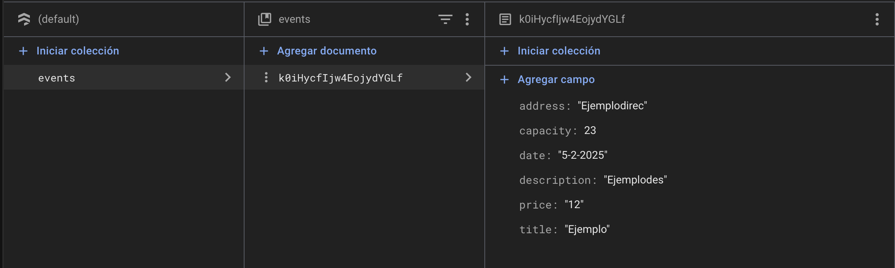

# Ejercicio 2 Examen Eventos

Este repositorio contiene una aplicación Android desarrollada en Kotlin utilizando Jetpack Compose y Firebase Firestore. La aplicación permite a los usuarios gestionar eventos, añadir nuevos eventos y ver la lista de eventos.

## Repositorio

El código fuente de la aplicación se encuentra en el siguiente repositorio de GitHub: [Aplicacion2_prueba2](https://github.com/jmartter/Aplicacion2_prueba2.git)

## Estructura de Pantallas

### Pantalla Principal

La pantalla principal (`MainScreen`) es el punto de entrada de la aplicación. Desde aquí, los usuarios pueden ver la lista de eventos y navegar a la pantalla de registro de eventos.

### Registro de Eventos

La pantalla de registro de eventos (`RegisterScreen`) permite a los usuarios agregar un nuevo evento. Los usuarios pueden ingresar el nombre del evento, la descripción, la dirección, el precio, la fecha y el aforo.

### Firebase Firestore

La aplicación utiliza Firebase Firestore para almacenar y recuperar la información de los eventos. A continuación se muestra una imagen de la estructura de la base de datos en Firebase.

